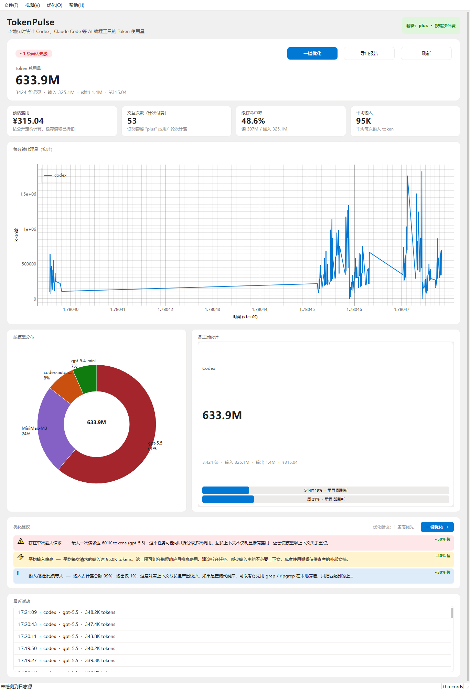
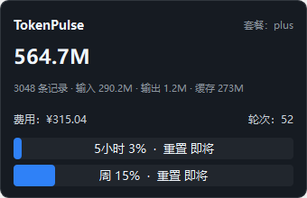
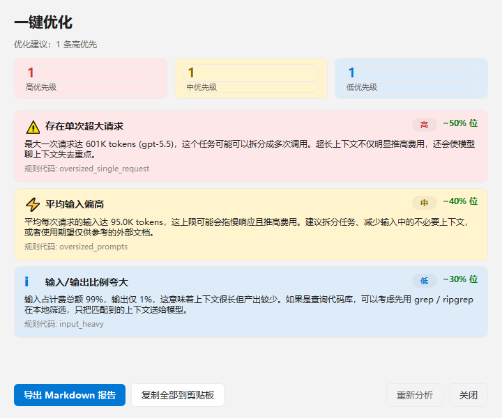

<div align="center">

# TokenPulse

**本地实时的 AI 编程工具 Token 可视化监控**

[](https://www.python.org/)
[](https://wiki.qt.io/Qt_for_Python)
[](LICENSE)
[](https://www.microsoft.com/)
[](#changelog)

> **TokenPulse** 实时读取 Codex、Claude Code 等 AI 编程 CLI 的 JSONL 会话日志，
> 在 Windows 原生桌面应用中展示 Token 用量、预估费用、5h/周配额和优化建议。
> 全程本地运行，零数据上传。

[English](#features) · [安装](#-安装) · [使用](#-使用) · [功能](#-核心功能) · [架构](#-架构) · [更新日志](#-changelog)



</div>

---

## ✨ 核心功能

| | 功能 | 说明 |
|---|---|---|
| 📊 | **实时 Token 统计** | 监听 JSONL 日志新增行，秒级更新折线图与最近活动 |
| 💰 | **费用预估** | 按各厂商公开定价计算，缓存读取已折扣 |
| 🎯 | **套餐感知** | 自动识别 Codex `plan_type`，按 token / 按轮次两种计费模式自动切换主指标 |
| 📈 | **5h/周配额跟踪** | 解析 Codex `rate_limits` 字段，显示用量条与重置倒计时 |
| 🍩 | **模型分布图** | 自绘甜甜圈图，无需 QtCharts 依赖 |
| 🔔 | **配额通知** | 5h 用量 70% / 90% 时触发系统托盘提醒（带冷却） |
| 🛠️ | **多工具支持** | Codex + Claude Code 开箱即用，可通过 Parser 接口扩展 |
| 💡 | **优化建议** | 6 条规则引擎：缓存命中、高价模型、超大提示、单次超大、输入/输出比例、思考占比 |
| 🖱️ | **一键优化** | Hero 区域大按钮直接打开完整优化助手对话框 |
| 🪟 | **系统托盘** | 关闭窗口即隐藏到托盘，330x240 迷你弹窗一眼看完整数 |
| 🎨 | **微软电脑管家风格** | 浅色主题、微软蓝 #0078D4 强调色、大圆角 |

---

## 📦 安装

### 系统要求

- **操作系统**：Windows 10 / 11（macOS / Linux 可运行但托盘/字体可能需要手动调整）
- **Python**：3.10 或更高版本
- **磁盘空间**：< 100 MB（含 PySide6 与 pyqtgraph 依赖）

### 步骤

```bash
# 1. 克隆仓库
git clone https://github.com/sun44863551/tokenpulse.git
cd tokenpulse

# 2. （推荐）创建虚拟环境
python -m venv .venv
.venv\Scripts\activate

# 3. 安装依赖
pip install -r requirements.txt
```

### 依赖列表

```
PySide6>=6.5     # Qt for Python — 桌面 UI
pyqtgraph>=0.13  # 实时折线图
watchdog>=3.0    # JSONL 文件监听
```

---

## 🚀 使用

### 启动主窗口

```bash
python -m tokenpulse
# 或
python run.py
```

首次启动会自动：

1. 扫描本机已安装的 AI 编程工具日志目录
2. 解析所有已有 JSONL 文件（**初始扫描**）
3. 启动文件监听，实时推送新事件

### 命令行参数

| 参数 | 作用 |
|---|---|
| `--tray-only` | 启动时仅显示系统托盘，不显示主窗口 |
| `--minimized` | 启动时主窗口最小化 |
| `--no-window` | 无窗口冒烟测试，运行几秒后退出（用于 CI / 调试解析器） |

示例：

```bash
python -m tokenpulse --tray-only     # 静默启动，常驻托盘
python -m tokenpulse --no-window     # 解析 + 存储自检
```

### 运行单元测试

```bash
python tests/test_parsers.py
```

预期输出：

```
running parser tests...
  codex parser: OK (tokens=185, plan=plus)
  claude-code parser: OK (tokens=395)
  storage roundtrip: OK (records=1, in=20, cost=0.0002)
all tests passed.
```

---

## 📸 界面预览

### 主仪表盘

顶部 Hero 区（状态 + 主数 + 三个大按钮）+ 4 个小统计丸 + 实时折线图 + 模型分布 + 工具列表 + 优化建议 + 最近活动。


### 系统托盘迷你弹窗



### 一键优化对话框



### 模型分布甜甜圈


---

## 🗂️ 自动识别的日志目录

| 工具 | 默认路径 | 格式 |
|---|---|---|
| Codex | `~/.codex/sessions/` + `~/.codex/archived_sessions/` | `*.jsonl`（每行一个事件） |
| Claude Code | `~/.claude/projects/` | `*.jsonl`（每行一个事件） |

可通过环境变量覆盖：

- `CODEX_HOME` / `CLAUDE_CONFIG_DIR`
- `AIUSAGE_CODEX_PATH` / `AIUSAGE_CLAUDE_CODE_PATH`

Codex JSONL 格式在 `tokenpulse/parsers/codex.py` 中文档化，是字段约定的真源。

---

## 🏗️ 架构

```
+---------------------+      +--------------------+      +-------------------+
|  JSONL log files    | ---> |  Pipeline (worker) | ---> |  Storage (SQLite) |
|  ~/.codex/...       |      |  - watchdog tail   |      |  + in-mem cache   |
|  ~/.claude/...      |      |  - stateful parser |      +---------+---------+
+---------------------+      +---------+----------+                |
                                       | on_usage / on_interaction  |
                                       v                             v
                              +------------------+          +------------------+
                              |  AppController   |  ----->  |   Dashboard UI   |
                              |  (Qt signals)    |          |  (PySide6 +      |
                              +------------------+          |   pyqtgraph)     |
                                                             +------------------+
```

### 关键模块

| 模块 | 职责 |
|---|---|
| `tokenpulse/parsers/` | 各工具的 JSONL 状态机解析器 |
| `tokenpulse/core/optimizer.py` | 6 条优化规则引擎 |
| `tokenpulse/core/pricing.py` | 各模型单价表（含缓存读取折扣） |
| `tokenpulse/core/config.py` | 源发现 + 环境变量覆盖 |
| `tokenpulse/storage/db.py` | SQLite + 内存聚合缓存 |
| `tokenpulse/watcher/file_watcher.py` | watchdog 包装的尾部监听 |
| `tokenpulse/ui/` | PySide6 桌面 UI（仪表盘 / 托盘 / 对话框） |

---

## 🛠️ 扩展新工具

仅需三步，即可为新的 AI CLI 添加监控支持：

1. **实现 Parser**：在 `tokenpulse/parsers/<tool>.py` 中继承 `BaseParser`，
   接收单行 JSON + `ParseContext`，返回零到多个 `ParseEvent`。
2. **注册**：`tokenpulse/parsers/__init__.py::_REGISTRY` 加入新 Parser。
3. **配置源**：在 `tokenpulse/core/config.py::discover_sources()` 中添加 `SourceConfig`。

管线、存储、UI 全部会自动接入。

---

## 📦 打包为单文件 EXE（可选）

```bash
pip install pyinstaller
pyinstaller --noconfirm --windowed --name TokenPulse --collect-submodules pyqtgraph run.py
```

产物在 `dist/TokenPulse/TokenPulse.exe`。

---

## 🤔 常见问题

**Q: 会把日志上传到云端吗？**
不会。TokenPulse 完全在本地运行，所有数据存储在用户目录的 SQLite 中，不联网。

**Q: 我用的是 OpenAI / Anthropic 直连 API，会被监控吗？**
不会。TokenPulse 只读取 AI CLI 工具（Codex、Claude Code 等）写入本地的 JSONL 日志，
直连 API 请求不会产生这些日志。

**Q: 一个已有 1GB 日志的环境首次扫描要多久？**
在普通 SSD 上约 30 秒；扫描期间 UI 会显示"加载中"。

**Q: 占用 CPU / 内存高吗？**
空载时几乎为 0；新增事件时短暂上升后立即回落。内存约 80-150 MB。

**Q: 可以同时监控多个工作区吗？**
可以。Codex 与 Claude Code 的日志按项目目录分开存放，工具列表会自动列出每个工具的累计用量。

---

## 📜 Changelog

### v0.2.5 — 微软电脑管家浅色主题（最新）
- 🎨 全面采用微软电脑管家 (PC Manager) 浅色主题
  - 背景 `#F3F3F3`，卡片 `#FFFFFF`，微软蓝 `#0078D4` 强调色
  - 大圆角 12-14px，Microsoft YaHei UI 字体优先
  - 状态 pill 四种：默认 / 成功 / 警告 / 危险
- 🛠️ 修复 Hero 卡被压扁导致大数字无法显示的 bug（改用 QScrollArea 包装）
- 🆕 Hero 区域：状态 pill + 34px 主数 + 副信息 + 三个大按钮
- 📊 4 个小统计丸：预估费用 / 交互次数 / 缓存命中率 / 平均输入
- 💬 一键优化对话框与系统托盘迷你弹窗同步浅色化

### v0.2.4 — 一键优化按钮
- 优化建议卡片右上角新增"一键优化"按钮
- 点击后打开完整优化助手对话框：顶部三色 KPI + 滚动列表 + 导出 / 复制 / 重分析

### v0.2.3 — 优化建议模块
- 6 条规则引擎（缓存命中、高价模型、超大提示、单次超大、输入/输出比例、思考占比）
- Dashboard 新增优化建议卡片
- 菜单 ·优化· 下可导出 Markdown 报告、复制单行总结、查看规则说明

### v0.2.2 — 修复与本地化
- 修复饼图布局裁切（延迟到布局后再绘制）
- 全局强制中文字体；饼图 <5% 分片合并为"其他"
- 修复主窗口标题乱码

### v0.2.1 — 中文 UI 简化
- 简化为 4 个主要区域：KPI 行、实时折线图、模型甜甜圈 + 工具列表、最近活动
- 移除热力图与 7 天堆叠柱

### v0.2.0 — 托盘与图表
- 系统托盘图标 + 330x220 迷你弹窗
- 关闭即隐藏到托盘
- 模型甜甜圈图 + 7x24 热力图
- 5h/周配额桌面通知
- 新增 `--tray-only` / `--minimized` 启动参数

### v0.1.0 — 首个发布
- 基础仪表盘、实时折线图、堆叠柱
- 工具卡片 + 5h/周配额条

---

## 🙏 致谢

以下三个开源项目在设计 TokenPulse 时提供了重要参考：

| 项目 | 借鉴点 |
|---|---|
| [juliantanx/aiusage](https://github.com/juliantanx/aiusage) | 多工具本地仪表盘概念、日志格式 |
| [mm7894215/TokenTracker](https://github.com/mm7894215/TokenTracker) | 桌面 dashboard 布局、菜单栏 widget |
| [jarrodwatts/claude-hud](https://github.com/jarrodwatts/claude-hud) | Claude Code 日志解析、quota 语义 |

---

## 📄 License

MIT — 详见 [LICENSE](LICENSE) 文件。

<div align="center">

**如果这个项目对您有帮助，欢迎 Star ⭐**

</div>
