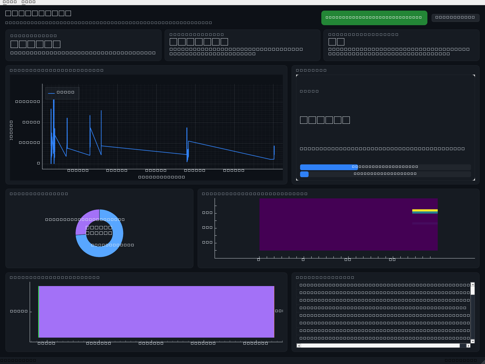
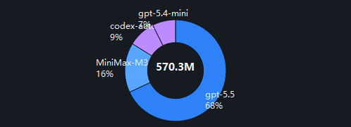
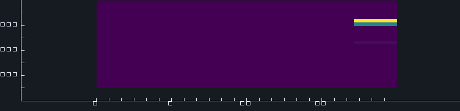
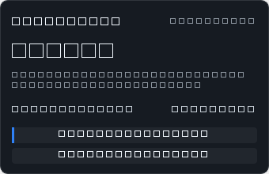

# TokenPulse

> Real-time, local-first token-usage visualizer for **Codex**, **Claude Code**, and
> other AI coding CLIs.

TokenPulse reads the JSONL session logs that AI coding agents already write
to disk, parses them into token / cost / interaction aggregates, and
shows everything in a native desktop dashboard that updates live as you
work.



## Highlights

- **Standalone desktop app** &mdash; a single window, no browser, no cloud.
- **Real-time** &mdash; uses `watchdog` to tail log files; new turns appear
  in the dashboard within a second.
- **Local-first** &mdash; all data lives in a SQLite database under your
  user data dir. Nothing is uploaded.
- **Token plan aware** &mdash; detects Codex's `plan_type` and switches the
  primary KPI from "tokens" to "interactions" automatically.
- **Quota tracking** &mdash; shows the 5h / weekly utilization that
  Codex already publishes in its `rate_limits` payload, with reset
  countdowns.
- **Multi-tool** &mdash; Codex and Claude Code today, easy to extend with
  a new parser.

## What's new in v0.2.0

- **System tray icon** with hover tooltip, click-to-popup, and right-click
  menu (Open / Refresh / Quit).  The tray icon is drawn programmatically
  in code, so we ship no PNGs.
- **Compact mini popup** (`340x220`) showing the headline number, the
  5-hour and weekly progress bars, and a quick cost / turns line.
  Click the tray icon to toggle it.
- **Close-to-tray** by default: clicking the window's `X` hides the
  window and leaves a notification; right-click the tray icon to quit.
- **Model donut chart** built on a custom `QGraphicsView` (no
  QtCharts dependency) and aggregated from `totals_by_model()`.
- **Daily activity heatmap** &mdash; a 7-day by 24-hour grid that
  shows which hours of the week see the most token activity.
- **Quota desktop notifications** &mdash; the 5-hour bar triggers a
  tray notification at 70% and 90% (with a per-threshold cooldown so
  you are not spammed).
- **Two new CLI flags**:
  - `--tray-only` &mdash; start hidden in the system tray.
  - `--minimized` &mdash; start with the main window minimized.

## Quick start

```bash
# from the project root
pip install -r requirements.txt
python -m tokenpulse          # launches the GUI
```

or, as a script:

```bash
python run.py
```

The first launch will:

1. detect the supported log directories on this machine,
2. parse every existing JSONL file once (the *initial scan*),
3. start watching the directories for new bytes and emit live updates.

### Smoke test (no window)

```bash
python -m tokenpulse --no-window
```

Runs the pipeline for a couple of seconds and exits.  Useful for
verifying that parsing and storage work in a headless environment.

## Screenshots

### Main dashboard


### Tokens by model (donut)



### Daily activity heatmap (7 x 24)



### System tray icon


### Mini popup (click the tray)



## What gets read

| Tool        | Default path                                  | Format                 |
| ----------- | --------------------------------------------- | ---------------------- |
| Codex       | `~/.codex/sessions/` + `~/.codex/archived_sessions/` | `*.jsonl` (one event per line) |
| Claude Code | `~/.claude/projects/`                         | `*.jsonl` (one event per line) |

You can override either path with the standard environment variables:

- `CODEX_HOME` / `CLAUDE_CONFIG_DIR`
- `AIUSAGE_CODEX_PATH` / `AIUSAGE_CLAUDE_CODE_PATH`

The Codex JSONL format is documented in
`tokenpulse/parsers/codex.py`; the file is the canonical source of truth
for the keys we read.

## Architecture

```
+---------------------+      +--------------------+      +-------------------+
|  JSONL log files    | ---> |  Pipeline (worker) | ---> |  Storage (SQLite) |
|  ~/.codex/...       |      |  - watchdog tail   |      |  + in-mem cache   |
|  ~/.claude/...      |      |  - stateful parser |      +---------+---------+
+---------------------+      +---------+----------+                |
                                       | on_usage / on_interaction  |
                                       v                             v
                              +------------------+          +------------------+
                              |  AppController   |  ----->  |   Dashboard UI   |
                              |  (Qt signals)    |          |  (PySide6 +      |
                              +------------------+          |   pyqtgraph)     |
                                                              +------------------+
```

* **Parsers** are stateful JSONL walkers.  Each tool has its own
  `BaseParser` subclass in `tokenpulse/parsers/`.  They emit
  `UsageRecord` and `InteractionRecord` events.
* **Pipeline** (`tokenpulse/watcher/file_watcher.py`) is a plain Python
  class that runs in a background thread.  It uses `watchdog` for
  instant notifications and a poll loop as a safety net.
* **Storage** (`tokenpulse/storage/db.py`) is a tiny SQLite wrapper with
  an in-memory aggregate cache so the UI never has to re-scan the table.
* **AppController** bridges worker callbacks to Qt signals on the GUI
  thread.
* **UI** (`tokenpulse/ui/`) is PySide6 + pyqtgraph.  No web tech, no
  embedded browser.

## Interaction counting

Codex's `event_msg.payload.type === "user_message"` (and Claude Code's
`type === "user"`) marks one user turn.  Subscription plans like
`plus`, `pro`, `team`, `max`, or `free` are charged per turn, so the
**Interactions** KPI is the relevant counter for those users.  When the
plan is not in that set (e.g. raw API key billing), the card flips back
to "User turns" and the line still tracks the same underlying
`interactions` table.

The Codex log also publishes `rate_limits.{primary,secondary}.used_percent`
plus a reset timestamp, so TokenPulse can render the same 5-hour /
weekly quota gauge that the official desktop UI shows.

## Pricing

Pricing data lives in `tokenpulse/core/pricing.py`.  Values are USD per
1M tokens for the most common OpenAI and Anthropic models, with cache
reads discounted as published by each vendor.  Unknown models return
`0` so the UI still works &mdash; the cost card will simply show `$0`.

## Changelog

- **v0.2.0** &mdash; system tray, mini popup, pie chart, heatmap,
  quota desktop notifications, close-to-tray, `--tray-only`,
  `--minimized`.
- **v0.2.2** &mdash; 修复饼图布局裁切（延迟到布局后再绘制，以 widget 本体尺寸计算）；全局强制中文字体；饼图 <5% 分片合并为“其他”；修复主窗口标题乱码；弹窗中“重置 now”改为中文。
- **v0.2.1** &mdash; 中文 UI，简化为 4 个主要区域：KPI 行、实时折线图、模型饰饰图+工具列表、最近活动。移除了热力图和 7 天堆叠柱。
- **v0.1.0** &mdash; initial dashboard, line chart, stacked bar,
  per-tool cards, 5h / weekly quota gauges.

## Extending

To add support for a new tool:

1. Implement `BaseParser` in `tokenpulse/parsers/<tool>.py`.  The parser
   receives one line at a time plus a `ParseContext`; return zero or
   more `ParseEvent`s.
2. Register it in `tokenpulse/parsers/__init__.py::_REGISTRY`.
3. Add a `SourceConfig` to `discover_sources()` in
   `tokenpulse/core/config.py`.

That's it &mdash; the pipeline, storage, and UI all pick it up
automatically.

## Packaging (optional)

To produce a single-file Windows executable:

```bash
pip install pyinstaller
pyinstaller --noconfirm --windowed --name TokenPulse --collect-submodules pyqtgraph run.py
```

The result lives in `dist/TokenPulse/TokenPulse.exe`.

## Why this project exists

Three prior-art projects were studied while designing TokenPulse:

| Project                                                   | Notes                                                           |
| --------------------------------------------------------- | --------------------------------------------------------------- |
| [`juliantanx/aiusage`](https://github.com/juliantanx/aiusage) | Multi-tool local dashboard, React web UI, npm install.         |
| [`mm7894215/TokenTracker`](https://github.com/mm7894215/TokenTracker) | Cross-platform tracker with macOS menu-bar widget.            |
| [`jarrodwatts/claude-hud`](https://github.com/jarrodwatts/claude-hud) | Claude Code plugin showing live context.                        |

We learned the log formats and quota semantics from `aiusage` and
`claude-hud`, and the desktop dashboard layout from `TokenTracker`.
The differences:

- **Native window, not a browser** &mdash; faster startup, no port
  management, no `node`.
- **No extra dependencies for users who already have Python** &mdash;
  PySide6 is the only big wheel we re-invent.
- **Token plan awareness baked in** &mdash; the KPI card flips to
  counting turns when the plan is metered per interaction.

## Development

```bash
python -m pip install -r requirements.txt
python -m tokenpulse --no-window  # smoke test (no GUI)
python -m tokenpulse --tray-only    # start hidden in the tray
python -m tests.test_parsers       # parser unit tests
python run.py                     # full GUI
```

To add a new model to the pricing table, edit
`tokenpulse/core/pricing.py` and submit a PR.

## License

MIT